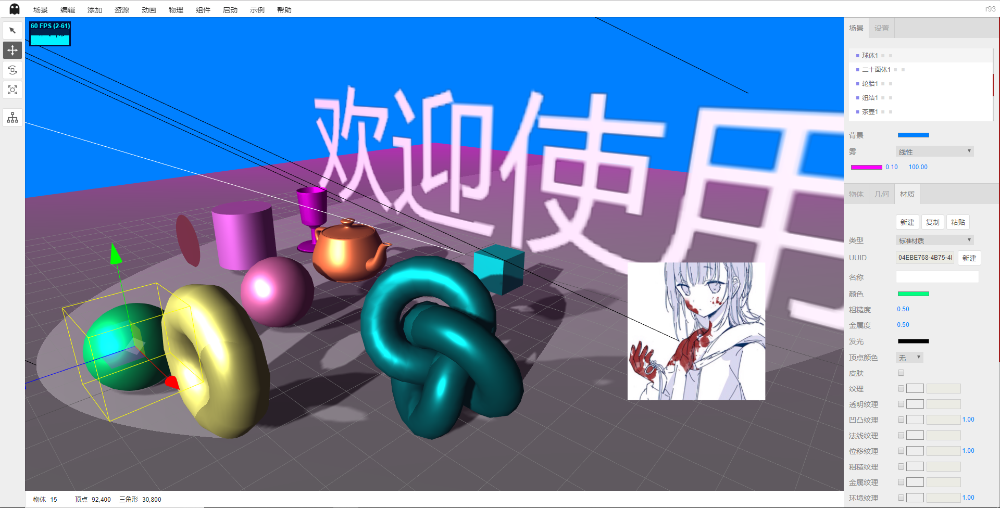
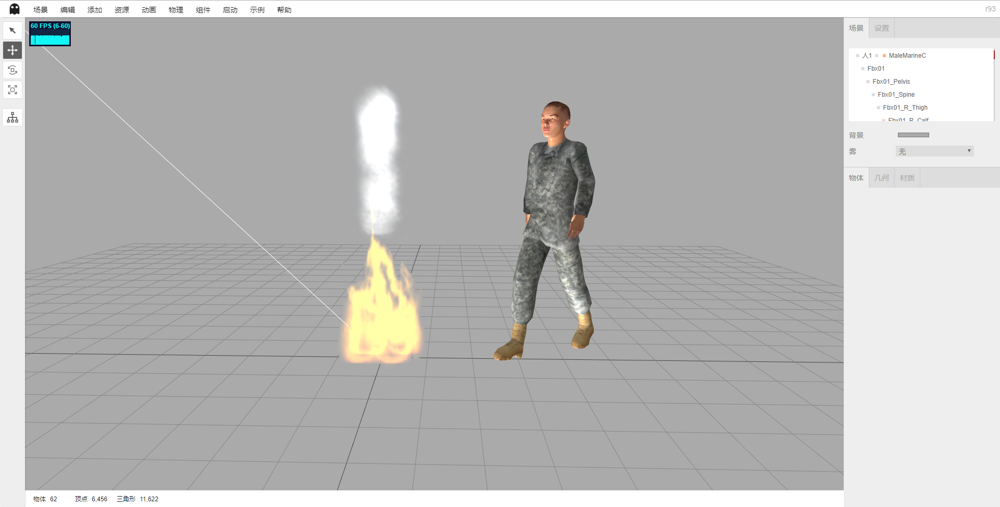
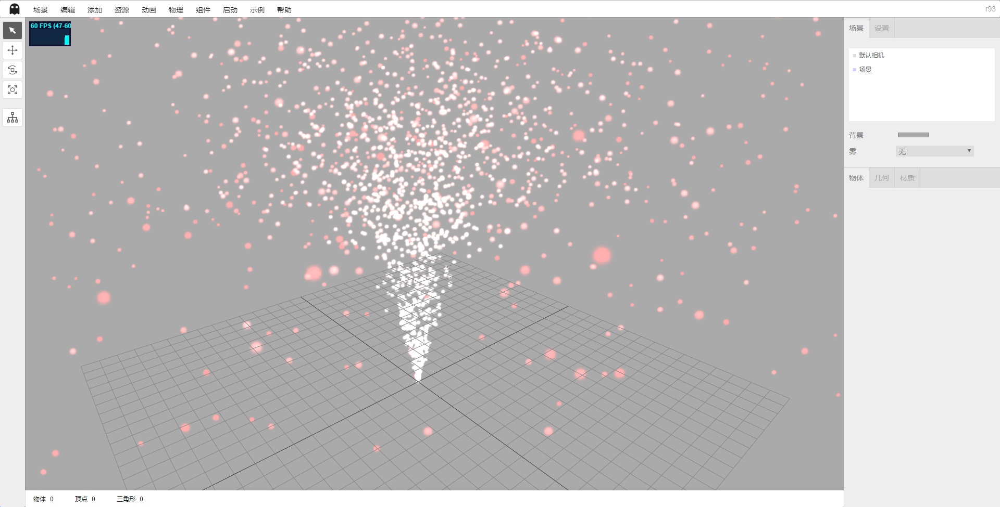
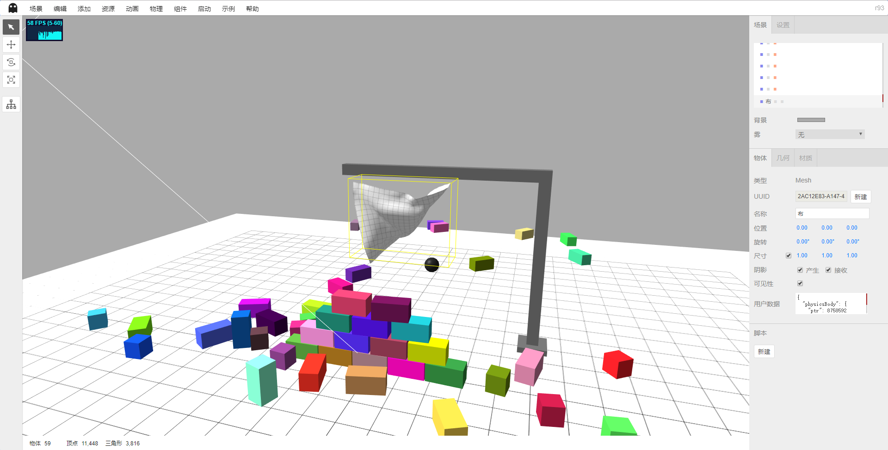
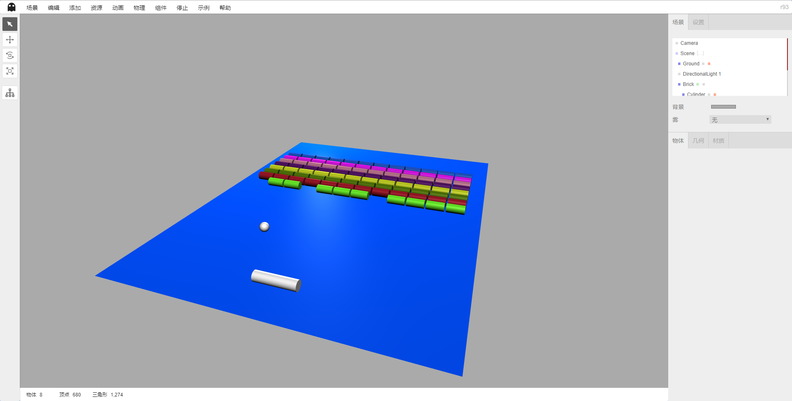

# ShadowEditor示例

为了避免ShadowEditor项目由于添加大量材质和模型过大，所以新建个项目放例子。

所有示例和模型都来自`three.js`，版权归原作者所有。

## 示例截图

1. 场景

2. 人、火焰、烟。

3. 粒子发射器

4. 初音未来

5. 物理引擎

6. 打砖块小游戏

## 相关网站

* three.js：https://threejs.org/