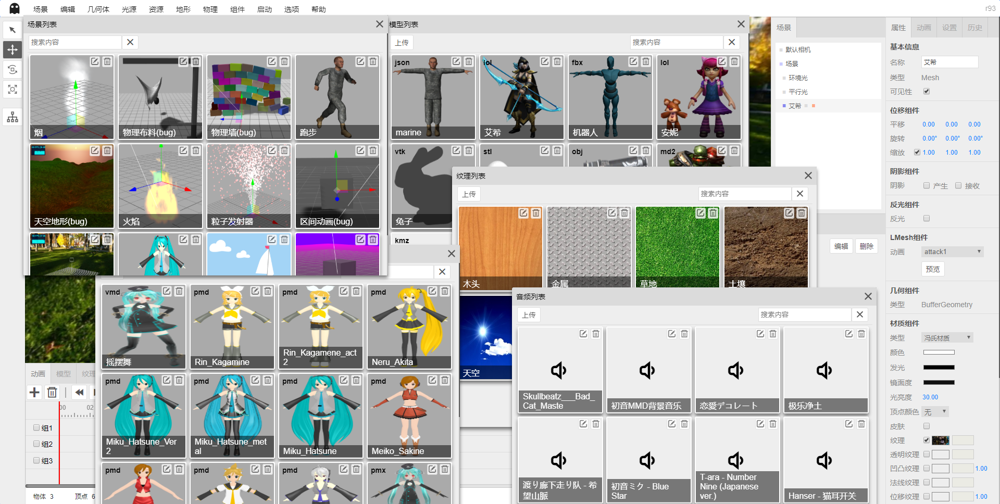

# ShadowEditor示例

为了避免ShadowEditor项目过大，所以新建个项目放示例，不定期更新。

示例和模型来自`three.js`和其他开源项目，版权归原作者所有。

## 项目截图

## 演示地址

国内：https://tengge1.gitee.io/shadoweditor-examples/

国外：https://tengge1.github.io/ShadowEditor-examples/

## 使用说明

国内：https://tengge1.gitee.io/shadoweditor/

国外：https://tengge1.github.io/ShadowEditor/

## 项目源码

国内：https://gitee.com/tengge1/ShadowEditor

国外：https://github.com/tengge1/ShadowEditor